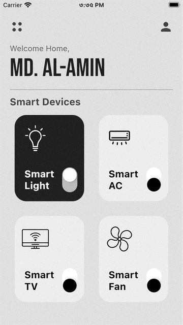

# Smart Home UI (Flutter Project)

Smart Home UI Flutter Application to Practice Flutter Modern UI Design.

## On Developing....

## Live Site:

#### [Smart Home UI](#)

## Download APK/Software:

#### [Smart Home App](#) 

## GIF:

| Home Screen (GIF)      | 
|  :---:       |    
|        | 

### Disclaimer
This project is made only for educational purpose. Anyone can use it but the risk has to be taken by the user. For any query please contact me.

### Repository Owner Info

### Md. Al-Amin
##### Junior Software Engineer (Android & iOS) at Rokomari.com

__Email :__ [ alamin.karno@outlook.com ](mailto:alamin.karno@outlook.com) \
__Github :__ [Md. Al-Amin](https://github.com/alamin-karno) \
__Facebook :__ [মোঃ আল-আমিন খন্দকার কর্ণ](https://facebook.com/alamin.kanro) \
__Linkedin :__ [Md. Alamin](https://www.linkedin.com/in/alaminkarno/)

